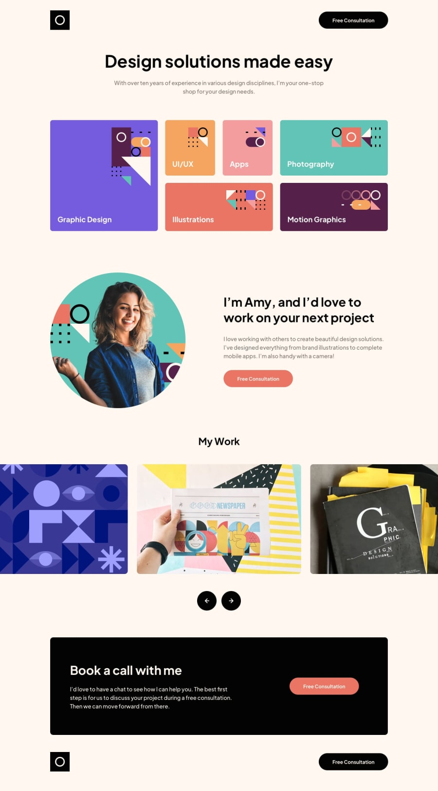

# designe-solution

This is a solution to the [Single-page design portfolio challenge on Frontend Mentor](https://www.frontendmentor.io/challenges/singlepage-design-portfolio-2MMhyhfKVo). Frontend Mentor challenges help you improve your coding skills by building realistic projects. 

## Table of contents

- [Overview](#overview)
  - [Screenshot](#screenshot)
  - [Links](#links)
  - [Built with](#built-with)
- [Author](#author)

## Overview

### Screenshot

### Links

- Solution URL: [Solution](https://github.com/nikamerebashvili95/designe-solution)
- Live Site URL: [GitHub Live URL](https://nikamerebashvili95.github.io/designe-solution/)

### Built with

- Semantic HTML5 markup
- CSS custom properties
- Flexbox
- Responsive
- Javascript

## Author

- GitHub - [Nika Merebashvili](https://github.com/nikamerebashvili95)

